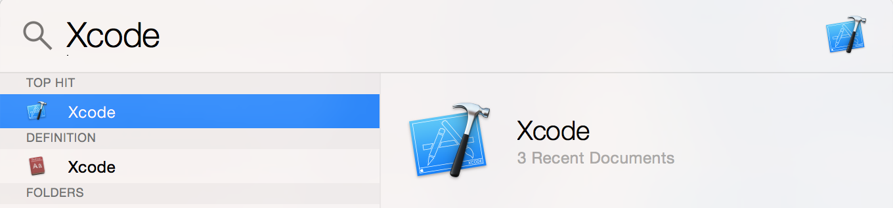

---
title: "Installing the Software"
slug: installing-the-software
---     

Xcode is to writing apps for iPhone what a word processor is to writing essays. It will format your code, check it for errors, and run it for you. If you already have Xcode, make sure it is version 5 or later. Earlier versions won't work.

If you are running OSX 10.8 or later, get the latest version of Xcode here.

If you are running OSX 10.7 or earlier, first download the free upgrade to OSX 10.9 right here.

Once it is done downloading, the Xcode application will appear in your applications folder. You can look for it using Spotlight (the magnifying glass in the top right corner).

Well done, you're set to get started!
